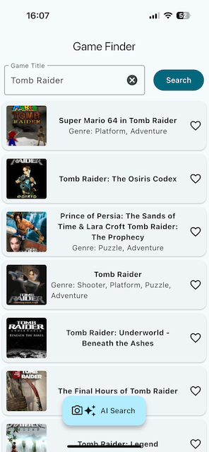
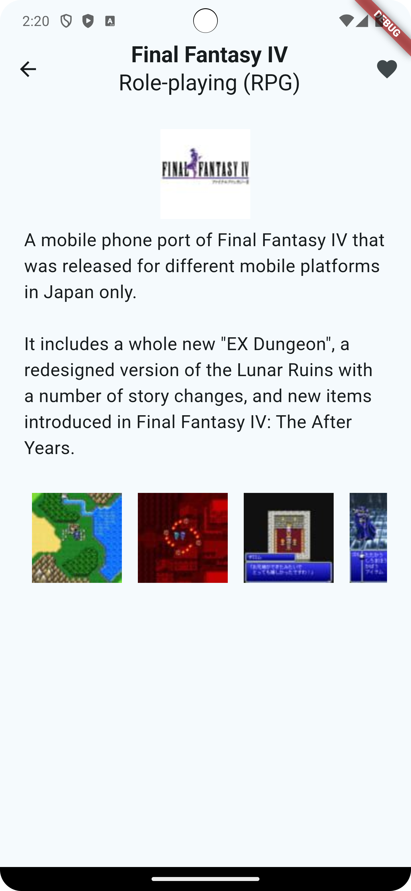

# Game Finder

## Overview

_Game Finder_ is a flutter application for iOS and Android that lets you search the IGDB library
and mark your favorites.

## Technologies

_Flutter_ | _Dart_ | _bloc_ | _http_ | _hive_ | _go_router_

## Images

 

## Usage

### Prerequisites

- Flutter SDK
- Installed iOS or Android Emulator

### Installation

1. Clone this repository:
   ```bash
   git clone https://github.com/chris-prenissl/game_finder.git
   ```
2. Start a emulator

3. Open the Terminal inside the project folder:
   ```bash
   flutter run
   ```

## License

This project is licensed under the MIT License - see the [LICENSE](LICENSE) file for details.