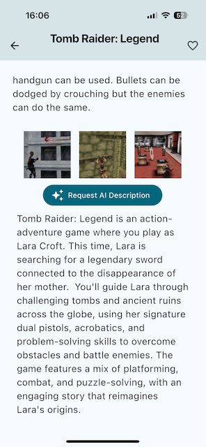

# Game Finder

## Overview

_Game Finder_ is a flutter application for iOS and Android that lets you search the IGDB library
by capturing an image that is analyzed by gemini pro model. If you want additional descriptions
you can let the AI describe to the game.


## Technologies

_Flutter_ | _Dart_ | _gemini ai_ | _bloc_ | _http_ | _hive_ | _go_router_

## Images

<div style="display: flex;">
   
   
</div>

## Usage

### Prerequisites

- Twitch account with a app project (see: https://api-docs.igdb.com/#getting-started)
- Gemini API key (see: https://ai.google.dev/gemini-api/docs/api-key)
- Flutter (see: https://docs.flutter.dev/get-started/install)

### Installation

1. Clone this repository:
   ```bash
   git clone https://github.com/chris-prenissl/game_finder.git
   ```
2. Create a .env file in the project's root with the following secrets from IGDB
   ```bash
   CLIENT_ID="client_id"
   CLIENT_SECRET="client_secret"
   GEMINI_API_KEY="gemini_api_key"
   ```
3. Start a iOS or Android device

4. Open the Terminal inside the project folder:
   ```bash
   flutter run
   ```

## License

This project is licensed under the MIT License - see the [LICENSE](LICENSE) file for details.
